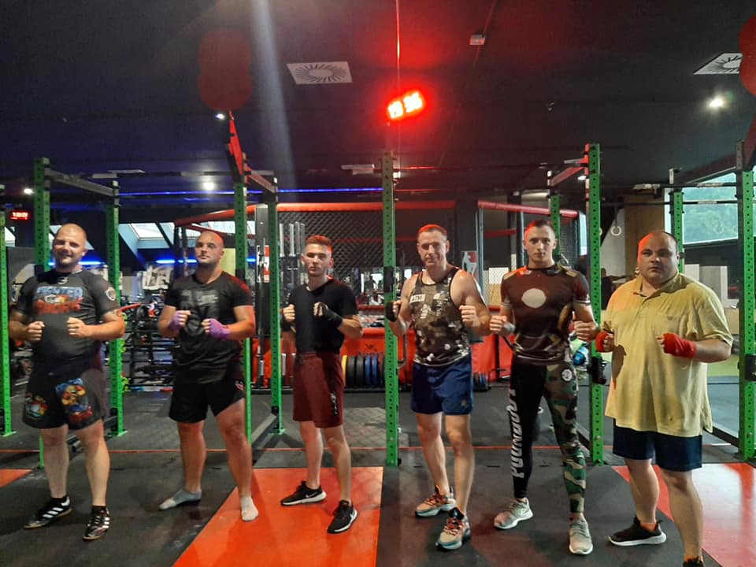
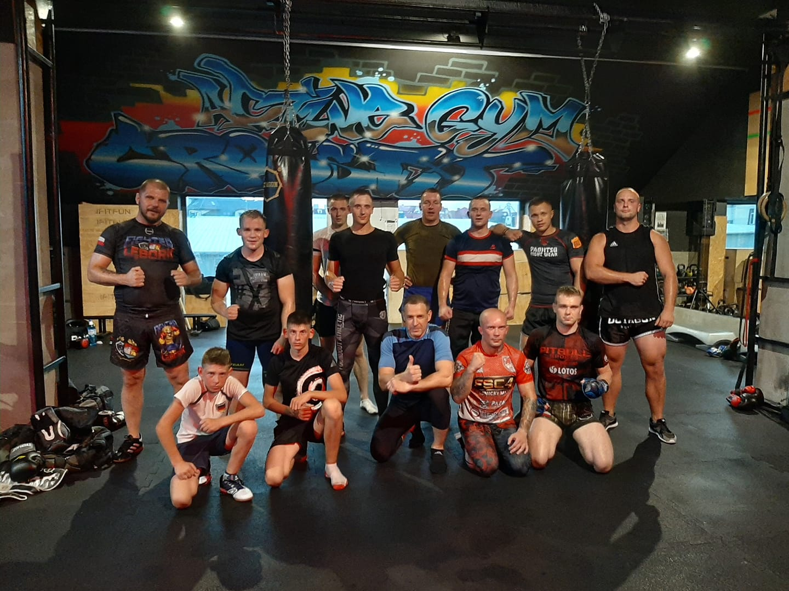

## IT

Hi, I'm Szymon Miks **Software Engineer** based in **Lębork, Poland**.

I've been working in IT industry since **2016**.

My first contact with programming was in junior high school, and it was C++ :smile:

I started my professional career with PHP and HTML/CSS as a web developer in a small company in my home city
[Lębork](https://en.wikipedia.org/wiki/L%C4%99bork).
Then I was charmed by Python and I decided to start a new journey as a Python developer  :snake:

**Topics that I'm interested in:**
- software engineering
- craftsmanship
- clean architecture
- clean code
- design patterns
- pragmatism in software development
- microservices
- modular monoliths
- DDD (Domain Driven Design)
- CQRS
- event sourcing
- event storming

Occasionally, I do blog about topics related to software engineering.

I'm always looking for new opportunities and challenges to grow my skills.
I love Python and the whole environment and community around this language.

You can contact me at: [contact@szymonmiks.pl](mailto:contact@szymonmiks.pl)

My homepage - [https://szymonmiks.pl/](https://szymonmiks.pl/)

## non-IT

Husband, dad, married to my lovely wife :couple:. Interested in philosophy and enterprise :bank:.

I've tried myself in startups (side projects) but none of them brought me any money :smile:
- [Gene Calc](https://gene-calc.pl/) - tool dedicated for calculations related to biological sciences, especially focused in field of genetics
- [Job for specialist](https://spec-jobs.pl/) - free publication of job advertisements
- [Gene Intelligence](https://geneintelligence.io/) - intelligent system for markers selection - advanced artificial intelligence algorithms to explore the associations between genes and phenotypes

I’m a big fan of martial arts. I used to train in high school and now decided to get back to it!

 

 

PS.
I love sunny weather and the sea! :sunglasses: :sunny: :ocean:
I'm a lucky man because my city is near [Łeba](https://en.wikipedia.org/wiki/%C5%81eba) city
so most of my free time during summer I spend there.

 

