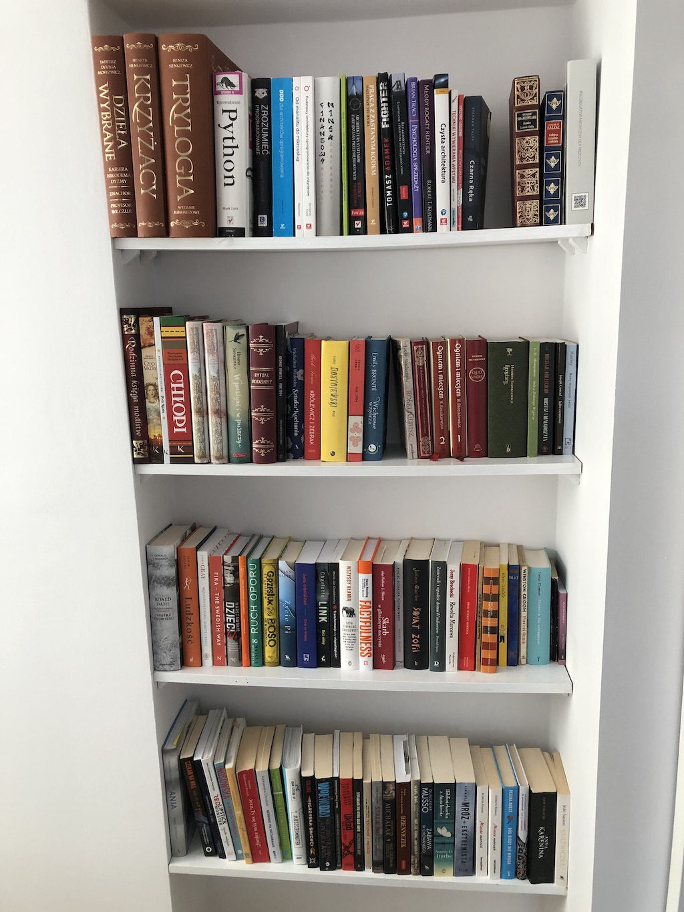

Here is the list of the IT books that are currently on my bookshelf :closed_book:. I decided to split them into three sections:

- Currently reading
- Read
- To read

## Currently reading
- [Patterns of Enterprise Application Architecture](https://www.amazon.com/Patterns-Enterprise-Application-Architecture-Martin/dp/0321127420/)

## Read

- [Test Driven Development: By Example](https://www.amazon.com/Test-Driven-Development-Kent-Beck/dp/0321146530)
- [Working Effectively with Legacy Code](https://www.amazon.com/Working-Effectively-Legacy-Michael-Feathers/dp/0131177052/)
- [Design Patterns: Elements of Reusable Object-Oriented Software](https://www.amazon.com/Design-Patterns-Elements-Reusable-Object-Oriented/dp/0201633612/)
- [Implementing Domain-Driven Design](https://www.amazon.com/Implementing-Domain-Driven-Design-Vaughn-Vernon/dp/0321834577)
- [Refactoring: Improving the Design of Existing Code](https://www.amazon.com/Refactoring-Improving-Existing-Addison-Wesley-Signature/dp/0134757599/)
- [Clean Architecture](https://www.amazon.com/Clean-Architecture-Craftsmans-Software-Structure/dp/0134494164)
- [The Pragmatic Programmer](https://www.amazon.com/Pragmatic-Programmer-Journeyman-Master/dp/020161622X/)
- [Clean Code](https://www.amazon.com/Clean-Code-Handbook-Software-Craftsmanship/dp/0132350882/)

## To read

- [Fundamentals of Software Architecture: An Engineering Approach](https://www.amazon.com/Fundamentals-Software-Architecture-Engineering-Approach/dp/B08X8H15BW/)
- [Monolith to Microservices: Evolutionary Patterns to Transform Your Monolith](https://www.amazon.com/Monolith-Microservices-Evolutionary-Patterns-Transform/dp/1492047848/)

If you are interested in non-IT books you can check out my [goodreads.com profile](https://www.goodreads.com/user/show/103430015-szymon-miks)

And here is how it looks like currently (there are no e-books that are on my Kindle of course :smile: )

