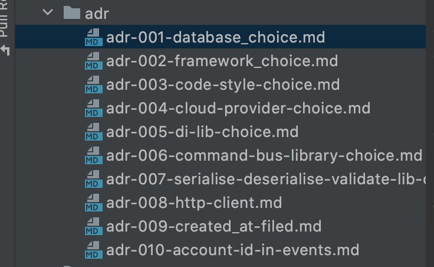

+++
author = "Szymon Miks"
title = "What is an ADR?"
description = "Architecture Decision Record - how to document architecture decisions in your project"
date = "2021-04-09"
image = "img/beatriz-perez-moya-XN4T2PVUUgk-unsplash.jpg"
categories = [
    "Software_Development", "Architecture"
]
tags = [
    "architecture", "software development", "adr"
]
draft = false
+++

How many times you made a decision in the project and after a couple of months you forgot why you or someone else made that decision?
From my perspective and experience it happened many times to me. 
There is always a pressure to deliver new features, and there is always a deadline with it. 
Because of that I believe everyone had a situation like: "hmm why I decided to do it in that way".

There is a solution for such problems, and it's called ADR, 
and in today's post I would like to do a brief intro about it.

## ADR

ADR is an acronym of Architecture Decision Record, and it's a way of documenting changes in our architecture. 
It's a pure text file with no pre-defined format or schema. 

The most popular structure/template is proposed by Michael Nygard in 2011.
[Here you can find his blog post about it.](https://cognitect.com/blog/2011/11/15/documenting-architecture-decisions) 
I follow his approach (maybe not all of it, but you will see it in the example section) in my project.

The template comprises four parts:

- Context - what this decision is about
- Decision/Solution - the decision made on how to solve the problem
- Consequences - the result of making a given decision
- Status - whether a decision has been made, withdrawn, or is it just a proposal

## ADR - good practises

- the record describes only one decision
- the record contains when this decision has been made
- record explains the reason behind this decision
- the record must be immutable
- all team members use ADR
- source code can contain a reference to the corresponding ADR
- records should be numbered

## ADL

The place where all the records are - is called ADL - architecture decision log.

It can be:

- git project repository (as I used in my project)
- Jira
- Google Drive
- Confluence

Use whatever works for your project/team/company. 
The most important thing is that every team member should be aware of where ADL is and how to access it.

## Examples

I would like to show you some examples from my projects. 
These examples were randomly chosen.
I used git repo as my ADL, and I was not strictly following Michael Nygard's template in all cases, you will see this in the following examples.
Mainly because I didn't feel the need to do this, and I didn't want to force it. 
It should be easy to use for others and easy to be adjusted to our requirements.



`adr-004-santander-vpn.md`

```markdown
### Context
Santander has the whitelisting mechanism.

The only way to connect to the Santander webservices is to do it via VPN.

### Solution
DevOps engineer from our team has created the VPN that allows us to connect to Santander API.

### Consequences
You have to have a VPN client installed on your computer. For example [tunnelblick.net](https://tunnelblick.net/downloads.html)

Each time when you want to run Santander API or integration tests you have to have a VPN connection.

### Status
APPROVED

### Comment
Contact @lukasz-ratajczyk-ng and ask him to provide the VPN config file to you.

```

`adr-002-framework_choice.md`

```markdown
Context: We need fast and flexible python web framework

Solution: We decided to use [Starlette](https://www.starlette.io/)

Comment: this framework supports async operations and gives us flexibility. We also considered FastAPI but in reality it's
a wrapper for Starlette and it has a few features which are not important/useful to us.
```

`adr-010-account-id-in-events.md`

```markdown
Context: We want to have history of user's actions in the platform

Solution: We are passing `account_id` to all events which are happening in the platform, based on that we will be
able to easily filter all events related to the account.
```

`adr-001-santander-client.md`

```markdown
### Context
We had very limited time, and we had to copy the whole code related to the Santander client and its connection.

### Solution
The code has been copied from the legacy client's application. We have put them into `acl` directory.
So everything that lives inside the `bank_api/santander/acl` directory is the legacy copied code.

### Consequences
It's hard to read and maintain.

### Status
APPROVED

### Comment
We didn't have time to develop a better solution, for now, it has to be as it is.
```

# Final thoughts

I really encourage you to use ADRs. From my perspective it's useful, and it really pays off. 
There are a lot of benefits and will make our work easier. 
If you have any questions are would like to talk about ADRs, don't hesitate to ping me directly or write a comment :wink:
