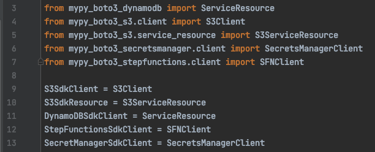

+++
author = "Szymon Miks"
title = "boto3 with type annotations"
description = "How to leverage types annotations when using the boto3 library"
date = "2021-04-11"
image = "img/annie-spratt-QckxruozjRg-unsplash.jpg"
categories = [
     "Software_Development", "Python", "AWS"
]
tags = [
    "python", "boto3", "aws", "type-annotations"
]
draft = false
+++

AWS is one of the most popular cloud providers nowadays,
which means that it's very possible that you will be working with AWS service.

For Python Amazon provides the SDK library [Boto3](https://boto3.amazonaws.com/v1/documentation/api/latest/index.html)
as you can read on their website:

> You use the AWS SDK for Python (Boto3) to create, configure, and manage AWS services,
> such as Amazon Elastic Compute Cloud (Amazon EC2) and Amazon Simple Storage Service (Amazon S3).
> The SDK provides an object-oriented API as well as low-level access to AWS services.

But there is one problem with this library from a developer's point of view. As you can read here:

> All of Boto3's resource and client classes are generated at runtime.
> This means that you cannot directly inherit and then extend the functionality of these classes because they do not exist until the program actually starts running.
> However it is still possible to extend the functionality of classes through Boto3's event system.

This means that it's not so easy to do type annotations, have IDE hints, and so on.
During this blog post, we will try to take a look at how we can approach this problem.

## Uncle Google - to the rescue

If you type `boto3 type annotations` in google the first result would be `boto3-type-annotations`.
Cool, we solved our problem :smile: &nbsp; Quick one, right?
Unfortunately not.
If you go to the [project's GitHub page](https://github.com/alliefitter/boto3_type_annotations) you will see a big heading with the title **DEPRECATED** :cry:

Are there any alternatives?

Inside that README there are links to the two projects:

- [https://pypi.org/project/boto3-stubs/](https://pypi.org/project/boto3-stubs/)
- [https://github.com/vemel/mypy_boto3_builder](https://github.com/vemel/mypy_boto3_builder)

`mypy_boto3_builder` - is a tool that allows us to build type annotations for `boto3`

`boto3-stubs`  - is a Python package that contains all annotations for all AWS services and it's generated by `mypy_boto3_builder`

I've tested both of them and unfortunately there are a couple of problems:

- with `mypy_boto3_builder` you need to generate them manually and store them inside your project's repo and configure your IDE to use them,
- PyCharm consumes too much CPU when it comes to using `boto3-stubs` which is precisely described [here](https://github.com/vemel/mypy_boto3_builder#pycharm-consumes-too-much-cpu),

Because I was not satisfied with my findings I decided to take a deeper look.
While searching on Google I've found that each AWS service has its own annotation as a separate python package.
Example [here](https://pypi.org/project/mypy-boto3-secretsmanager/). And yeah :tada: &nbsp; it's working as expected!

In my project, I'm using `dynamodb, s3, secretsmanager and stepfunctions`

I didn't think long, and I installed all of them

```bash
$ poetry add mypy-boto3-dynamodb, mypy-boto3-s3, mypy-boto3-secretsmanager, mypy-boto3-stepfunctions
```


And yeah :tada: &nbsp; it's working as expected!

With this approach there is no CPU problem inside PyCharm and I can enjoy this beautiful view :smile:




## Summary

I hope you enjoy it. Type annotations are very useful especially when it comes to working with software at a bigger scale.
I hope you have also learned something new from this post.
If you have any questions, feel free to ask :wink:
