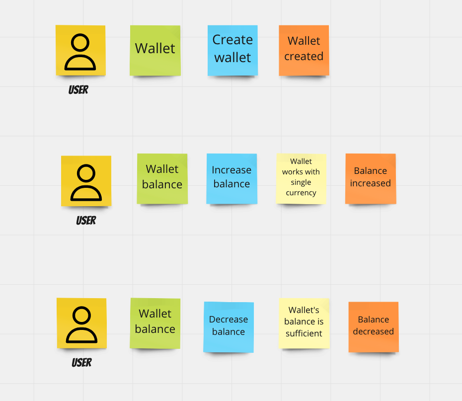

+++
author = "Szymon Miks"
title = "Optimistic locking with Python"
description = "Optimistic offline lock pattern explained with Python examples"
date = "2022-09-15"
image = "img/fly-d-mT7lXZPjk7U-unsplash.jpeg"
categories = [
     "Python", "Software_Development"
]
tags = [
    "python", "software development", "optimistic locking", "concurrency control"
]
draft = true
mermaid = true
+++

## Intro

Applications that we create are used by many end-users at the same time. It is called **concurrent access**.
This may cause problems with data consistency - especially when it comes to saving data to the database.
When two concurrent requests are made there is a risk that we **lose** our data and have inconsistent read operations.
This is especially true when one user is updating the data and the other wants to read it at the same time.
In today's article, I would like to show you how to apply one pattern called **Optimistic offline lock** which
can help us in such situations.

The shorter name of this pattern is **optimistic locking**. So if you find such a name somewhere on the internet, it is the same pattern.

As always all the examples will be in Python.

I would like to show you this with 3 different databases:
- MongoDB
- DynamoDB
- SQLite

## What is optimistic offline lock

An **optimistic offline lock** pattern solves this problem by checking if changes that we want to add to our database are not in conflict with the changes introduced by someone/something else.

Successfully checking before sending data to the database means we can safely add our modifications.

We can do such verification by checking whether, since we fetched our data from the database, no one else has introduced any changes at that time.

The most popular implementation is adding the `version` property to our database record/document.

When we fetch our record/document the `version` value is saved locally in the memory together with other record data.
Then, if we want to add our modifications, all we need to do is to check our local `version` value with the `version` value that is currently in the database. 
If the values are the same it means that we can apply our changes together with incrementing the `version` value.

I can imagine this description may be tough to get the wider context. Let me show you this on the diagram:


sequenceDiagram
    User A->>+Database: Get wallet with id=1 
    Database ->>+ User A: Returns wallet with id=1
    User B ->>+ Database: Get wallet with id=1
    Database ->>+ User B: Returns wallet with id=1
    User A ->>+ Database: Edit wallet's data
    Database ->>+ User A:  Successfully edited wallet's data
    User B ->>+ Database: Edit wallet's data
    Database ->>+ User B: Error, wrong version!



## Lost Update problem

One of the concurrent access anomalies is **Lost Update** problem. 

Two users at the same time do the read operation and update operation on the application side in one cycle. 

For example, we want to increase the wallet balance. Let's assume that the initial wallet balance is **10**. 
We have two concurrent requests to our application. 
The first one is retrieving the wallet from the DB and increasing the balance by **5**. The wallet balance is now **15**.
The second one is also retrieving the wallet from the DB and increasing the balance by **10**. The wallet balance is **20** which
is incorrect because it should be **25**.

This is how it looks on the diagram.

(*I used SQL expressions but the DB engine does not matter. You can see it later on in my examples*)


sequenceDiagram
    User A->>+Database: SELECT wallet.balance FROM wallet WHERE id = 1 
    Database ->>+ User A: 10
    User B ->>+ Database: SELECT wallet.balance FROM wallet WHERE id = 1
    Database ->>+ User B: 10
    User A ->>+ Database: UPDATE wallet SET balance = 15 WHERE id = 1
    Database ->>+ User A: 
    User B ->>+ Database: UPDATE wallet SET balance = 20 WHERE id = 1
    Database ->>+ User B: 
    User A ->>+ Database: COMMIT
    User B ->>+ Database: COMMIT


Do you see the problem?

The **optimistic offline lock** pattern is a way to prevent such situations. 

## Examples

For this article, I have figured out the simple *Wallet* object, where we can increase and decrease the balance.

The requirements look like that:



The Wallet object is the one that we want to store in our database and protect using optimistic locking.

The code with tests you can find on my GitHub :rocket:

https://github.com/szymon6927/szymonmiks.pl/tree/master/blog/examples/src/optimistic_locking

### DynamoDB
```python
class DynamoDBWalletRepository(IWalletRepository):
    ...
    
    def update(self, wallet: Wallet) -> None:
        try:
            update_expression = "set balance=:balance_value, version=:version_value"

            expression_attribute_values = {
                ":balance_value": wallet.balance,
                ":version_value": wallet.version + 1,
            }

            self._table.update_item(
                Key={"id": wallet.id, "created_at": wallet.created_at.isoformat()},
                UpdateExpression=update_expression,
                ExpressionAttributeValues=expression_attribute_values,  # type: ignore
                ConditionExpression=Attr("version").eq(wallet.version),
                ReturnValues="UPDATED_NEW",
            )
        except ClientError as error:
            if error.response["Error"]["Code"] == "ConditionalCheckFailedException":
                raise OptimisticLockingError.build(wallet.id)

            raise RepositoryError.update_operation_failed() from error

```

### MongoDB
```python
class MongoDBWalletRepository(IWalletRepository):
    ...

    def update(self, wallet: Wallet) -> None:
        try:
            result = self._collection.update_one(
                {"_id": wallet.id, "version": wallet.version},
                {"$set": {"balance": Decimal128(wallet.balance), "version": wallet.version + 1}},
            )

            if result.modified_count == 0:
                raise OptimisticLockingError.build(wallet.id)
        except PyMongoError as error:
            raise RepositoryError.update_operation_failed() from error

```

### SQLite
```python
class SQLiteWalletRepository(IWalletRepository):
    ...
    
    def update(self, wallet: Wallet) -> None:
        cursor = self._connection.cursor()

        sql = "UPDATE wallets SET balance = ?, version = ? WHERE id = ? AND version = ?"
        params = (str(wallet.balance), wallet.version + 1, wallet.id, wallet.version)

        try:
            result = cursor.execute(sql, params)

            if result.rowcount == 0:
                raise OptimisticLockingError.build(wallet.id)
        except sqlite3.Error as error:
            raise RepositoryError.update_operation_failed() from error

```

And this is what the test example test for DynamoDB looks like:
```python
def test_optimistic_locking_works(wallet_dynamodb_table_mock: Table, wallet: Wallet) -> None:
    # given
    repository = DynamoDBWalletRepository(wallet_dynamodb_table_mock)
    repository.create_new(wallet)

    # when
    wallet = repository.get(wallet.id)

    # and
    someone_modified_the_wallet_in_the_meantime(repository, wallet.id)

    # and
    wallet.increase_balance(Decimal(52), Currency.GBP)

    # then
    with pytest.raises(OptimisticLockingError):
        repository.update(wallet)
```

I encourage you to check the whole code on my [GitHub](https://github.com/szymon6927/szymonmiks.pl/tree/master/blog/examples/src/optimistic_locking). 
In case of any questions, please let me know :wink:

## Summary

An optimistic offline lock pattern is not a silver bullet. 
It will not solve all the problems related to the concurrent data access for us.
But in comparison to other patterns, it is quite easy to implement and maintain. 
In my opinion, it should be a default implementation when it comes to concurrent data access.

I would like to mention other patterns/solutions that you can use if you feel that optimistic locking is not enough for you:
- Pessimistic offline lock
- Atomic writes
- Setting the appropriate level of transaction isolation level (for SQL databases)
- Coarse-Grained Lock


## Appendix

A short side note at the end of this article for you.
From my experience, many of these problems may be solved by a discussion with our business experts. 
Problems with concurrent data access, it is not always a technical issue. 
It may be a problem with how we understand and implement our business logic.
So please do not be scared. 
Ask questions to business people.
