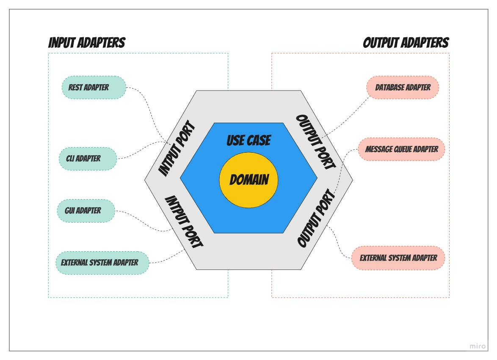
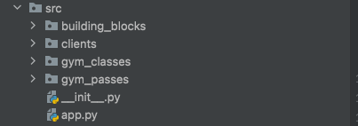
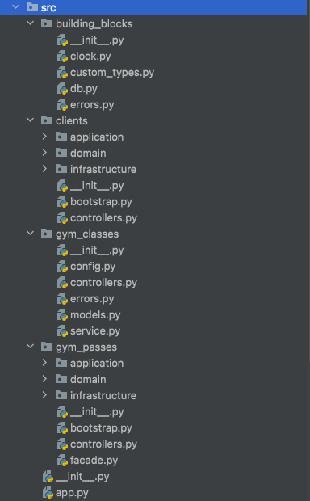
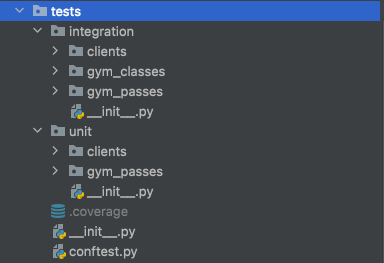

+++
author = "Szymon Miks"
title = "Hexagonal architecture in Python"
description = "Let me smoothly show you a hands-on example using our lovely Python language (FastAPI example included)."
date = "2022-10-07"
image = "img/james-hon-zmFOpLrgBn4-unsplash.jpg"
categories = [
     "Python", "Software_Development", "Architecture"
]
tags = [
    "python",
    "software development",
    "architecture",
    "hexagonal architecture",
    "clean architecture",
    "ports and adapters"
]
draft = true
+++

## Intro

Hexagonal architecture is one of the style of application architecture that you can use in your project.
In today's blog post I would like to show you, how you can build your application using hexagonal architecture with Python.

I don't want to focus on the theoretical side of it - there are many such materials on the internet.
Instead, I would like to show it to you from a practical perspective.

## History

Originally **hexagonal architecture** was invented by [Alistair Cockburn](https://en.wikipedia.org/wiki/Alistair_Cockburn) in 2005.

Then around 2008, Jeffrey Palermo invented something very similar that he called **onion architecture**.

And then as the last one, around 2011 [Robert C. Martin](https://en.wikipedia.org/wiki/Robert_C._Martin) came up with his idea called **clean architecture**.

So if you heard terms like:
- hexagonal architecture (aka. ports and adapters)
- onion architecture
- clean architecture
- screaming architecture

It’s all about the same idea. Of course, there are some details that are different but in general, the idea is the same.

## Quick intro

Here is how it looks on the diagram:

I will not go in-depth with the explanation of it.
Instead, I will give you a quick intro to all the concepts from the diagram.
I believe the best explanation will be a real example where I apply all of it.
You can find it in the section below.

In general, ports are responsible for communication with the outside world.
Usually, they are implemented as interfaces.
Adapters are concrete implementations of our ports.

**input port (aka. driver port or primary port)** - it exposes the application feature to the outside world, it’s an entry point to our business logic

**input adapter** - it's a concrete implementation of how we want to enter our application, for example via REST endpoint

**output port (aka. driven or secondary)** - it is used to interact with outbound things, for example, reading/writing data from a database

**output adapter** - it is a concrete implementation of the above. For example, implementation of communication with a specific database, eg MySQL

**use case (aka. application layer)** - this layer answers the question “what to do”, it controls the flow

**domain** - in opposition to the above layer, this one answers the question “how to do”, here our business logic lives, this is the place where our application makes money, it's the heart of our app

As you can see on the diagram the use case layer knows what to do but is not aware of how to do it.
The use case layer delegates it to the domain layer.
Having that the domain layer is not aware of any ports or adapters.
It's another separation of concerns but on the lowest level.

## Example

For the purpose of this article I created a separate project on my GitHub. You can find it here:
https://github.com/szymon6927/hexagonal-architecture-python

This project is a simplified gym management software. We have clients, gym classes and gym passes.

The project consists of four modules:

- **building_blocks** - contains all utilities used across different modules
- **clients** - module responsible for clients, there is no complicated business logic there, but we have a lot of integrations
that's why we use hexagonal architecture there
- **gym_classes** - simple CRUD responsible for gym classes management, no business logic there, no neeed to use hexagonal architecture there
- **gym_passes** - gym passes management, core of our business. This is where our business is making money.

There is no fancy structure for the gym_classes module. The answer is simple - there is no need for that.
We should use hexagonal architecture only where it's really needed.

I developed this example specifically to show you that using hexagonal architecture doesn't mean using it everywhere.
Not every module has to have it.

This is also visible in tests.

There are no unit tests for the gym classes module because unit tests for it will have no sense.
All we do there are CRUD operations.

When it comes to modules that were built using hexagonal architecture. They follow such structure:
- **application** - contains our use cases together with [DTOs](https://en.wikipedia.org/wiki/Data_transfer_object)
and other classes that responsible for coordinating the business process.
- **domain** - contains all domain objects like entities, [value objects](https://blog.szymonmiks.pl/p/value-objects-with-python/), etc.
The objects there are not [anemic](https://martinfowler.com/bliki/AnemicDomainModel.html),
they follow the principle of the **rich domain model** which means that we encapsulate data
and behaviors together.
You can check it by looking at [src/gym_passes/domain/gym_pass.py](https://github.com/szymon6927/hexagonal-architecture-python/blob/master/src/gym_passes/domain/gym_pass.py).
- **infrastructure** - contains output adapters, so objects responsible for communication with external world. For example database.
- **bootstrap.py** - contains the definition of our DI container. About the DI I wrote a separate article.
If you have not heard about a technique called "dependency injection" you can read it
[here](https://blog.szymonmiks.pl/p/dependency-injection-with-python-make-it-easy/)
- **controllers.py** - definition of our rest endpoints
- **facade.py** (optional) - if your module needs to expose some behaviors for other modules then I use a facade to achieve it.
It is the public API of our module

## Pros and Cons

**Pros:**
- testability - you can test your domain logic without any dependencies
- ability to postpone some decisions - when your project starts you don't have to know which database you will use, you can make this decision later on
- it supports easy technology change - you can change your REST adapter to a gRPC adapter without touching your business logic/core domain

**Cons:**
- if your project has multiple adapters it means that you will have more integration tests, this may impact the total execution time of your test suite
- it’s harder to navigate through the project with such architecture, mostly you will encounter interfaces instead of real implementation
- additional effort is needed to config the adapters, you need to have some mechanism that will specify: this adapter on prod env, this on local env, etc

## When to use / when not to use

If you are wondering about cases to which hexagonal architecture suits the best, I prepared a simple heuristic for you.

**Use if:**
- your project has complex and frequently changing business domain
- you need to implement the core domain of your application

**Don't use if:**
- your project or module has a [CRUD](https://en.wikipedia.org/wiki/Create,_read,_update_and_delete)-like complexity -
in such a scenario, there will be no benefits of hexagonal architecture, and it will be overengineering

## Additional resources

- [Alistair Cockburn’s original paper on Hexagonal Architecture](https://alistair.cockburn.us/hexagonal-architecture/)
- [Robert C. Martin's book "Clean Architecture"](https://www.amazon.com/Clean-Architecture-Craftsmans-Software-Structure/dp/0134494164)
- [Implementing the Clean Architecture](https://leanpub.com/implementing-the-clean-architecture)

## Summary

I hope you enjoyed it.
As with everything in our industry, hexagonal architecture is not a silver bullet.
It will not solve all the problems for you.
But it's a great way to improve things in our project especially when it comes to testability or the possibility to postpone some decisions.
If applied correctly it may boost your project and make your life easier.

Let me know what do you think, I would love to hear your opinion.
Also, if you have experience with hexagonal architecture let me know what are your thoughts/feelings about it.
