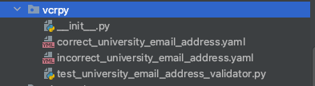
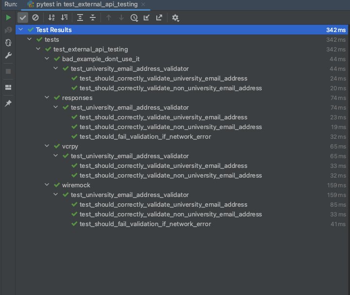

+++
author = "Szymon Miks"
title = "How to test an API request to the external system"
description = "In this blog post, I will show you how to test a request to an external API with Python"
date = "2023-05-02"
image = "img/john-schnobrich-FlPc9_VocJ4-unsplash.jpg"
categories = [
     "Python", "Testing", "Software_Development"
]
tags = [
    "python",
    "software development",
    "testing",
    "pytest",
    "responses",
    "vcrpy",
    "wiremock",
    "external api"
]
draft = false
+++

## Intro

Using external APIs is a common aspect of modern software development.
To be clear, by external API - I mean the API over which we have no control.
The simplest example I can think of is a payment gateway.
We have the 21st century, every business wants to have online payments.
To achieve this there are a lot of SaaS solutions like [Braintree](https://www.braintreepayments.com) that allow us to do this by using their API.

In today’s blog post, I want to show you how you can quickly and easily write unit tests for it.

## The problem

For this blog post purpose, let's imagine that we want to validate if the provided email address is a university email address.
We want to validate if the domain of provided email address belongs to some university.

To do this, we will use [University Domains and Names Data List & API](https://github.com/Hipo/university-domains-list)
this is an open-source project that provides the API that allows us to search for a university by domain.

We will use Python's [requests](https://requests.readthedocs.io/en/latest/) library.
This is the implementation of our client:
```python
# blog/examples/src/external_api_testing/university_email_address_validator.py

from abc import ABC, abstractmethod
from logging import Logger

import requests
from requests import RequestException

from src.external_api_testing.email_address import EmailAddress


class IUniversityEmailAddressValidator(ABC):
    @abstractmethod
    def validate(self, email: EmailAddress) -> bool:
        ...


class HipoLabsUniversityEmailAddressValidator(IUniversityEmailAddressValidator):
    """
    External API service for searching the university based on domain
    https://github.com/Hipo/university-domains-list/
    http://universities.hipolabs.com
    """

    def __init__(self, base_url: str, logger: Logger) -> None:
        self._base_url = base_url
        self._logger = logger

    def _is_university_domain(self, domain: str) -> bool:
        try:
            self._logger.info("Checking `%s` with HipooLabsClient", domain)

            url = f"{self._base_url}/search?domain={domain}"
            response = requests.get(url=url, timeout=(2, 3))
            response.raise_for_status()

            self._logger.info("Response [%s] json = %s", response.status_code, response.json())

            # If number of records in the response is greater than 0 it means that domain belongs to university
            return len(response.json()) > 0
        except RequestException as error:
            self._logger.error("An error occurred during domain verification!")
            self._logger.error("Error = %s", str(error))
            return False

    def validate(self, email: EmailAddress) -> bool:
        domain = email.domain

        if self._is_university_domain(domain):
            return True

        # skip suffix if email contains department name eg. @eti.pg.gda.pl -> the real domain is pg.gda.pl
        for part in domain.split(".")[:-2]:
            domain = domain[len(f"{part}."):]

            if self._is_university_domain(domain):
                return True

        return False

```

We want to test if the particular email address is a university one based on the response from `HipooLabs API`.

Let's see what possibilities we have :wink:.


## Solutions

Let me show you a few options using different libraries.

### :x: :x: unittest patch :x: :x:

Before I show you the code example, I want to **highlight** this is an **anti-pattern**.
I’m showing this to you only for one reason - to make you aware of it and tell you to stop using it anymore.

```python
# blog/examples/tests/test_external_api_testing/bad_example_dont_use_it/test_university_email_address_validator.py

from logging import Logger
from unittest.mock import Mock, patch

import pytest

from src.external_api_testing.email_address import EmailAddress
from src.external_api_testing.university_email_address_validator import HipoLabsUniversityEmailAddressValidator


@pytest.fixture
def hipo_base_url() -> str:
    return "http://universities.hipolabs.dev.com"


@pytest.fixture
def hipo_email_address_validator(hipo_base_url: str, test_logger: Logger) -> HipoLabsUniversityEmailAddressValidator:
    return HipoLabsUniversityEmailAddressValidator(hipo_base_url, test_logger)


@patch("src.external_api_testing.university_email_address_validator.requests")
def test_should_correctly_validate_university_email_address(
    mock_requests: Mock, hipo_email_address_validator: HipoLabsUniversityEmailAddressValidator
) -> None:
    # given
    mock_requests.get.return_value.status_code.return_value = 200
    mock_requests.get.return_value.json.return_value = [
        {
            "state-province": None,
            "domains": ["zut.edu.pl"],
            "country": "Poland",
            "web_pages": ["http://www.zut.edu.pl/"],
            "name": "Zachodniopomorska School of Science and Engineering",
            "alpha_two_code": "PL",
        }
    ]

    # when
    result = hipo_email_address_validator.validate(EmailAddress("john.deo@zut.edu.pl"))

    # then
    assert result is True


@patch("src.external_api_testing.university_email_address_validator.requests")
def test_should_correctly_validate_non_university_email_address(
    mock_requests: Mock, hipo_email_address_validator: HipoLabsUniversityEmailAddressValidator
) -> None:
    # given
    mock_requests.get.return_value.status_code.return_value = 200
    mock_requests.get.return_value.json.return_value = []

    # when
    result = hipo_email_address_validator.validate(EmailAddress("john.deo@gmail.com"))

    # then
    assert result is False

```


Let me explain why it is an **anti-pattern**, together with other articles that prove my opinion:

- :x: it breaks the "don’t mock what you don’t own" rule
- :x: if you change the `requests.get()` to `requests.Session().get()` the tests will fail
- :x: if you change the file name or move it to another package the tests will fail, you will have to modify each decorator manually
- :x: it makes your tests highly coupled with the implementation details

Additional materials:
- https://hynek.me/articles/what-to-mock-in-5-mins/
- https://nedbatchelder.com/blog/201206/tldw_stop_mocking_start_testing.html
- https://youtu.be/CdKaZ7boiZ4
- http://mauveweb.co.uk/posts/2014/09/every-mock-patch-is-a-little-smell.html
- https://www.cosmicpython.com/blog/2020-01-25-testing_external_api_calls.html


### :white_check_mark: responses

[responses](https://github.com/getsentry/responses) is a library created by the [Sentry](https://sentry.io/welcome/) team.
It is a utility library for mocking out the requests Python library.

```python
# blog/examples/tests/test_external_api_testing/responses/test_university_email_address_validator.py

from logging import Logger

import pytest
import responses

from src.external_api_testing.email_address import EmailAddress
from src.external_api_testing.university_email_address_validator import HipoLabsUniversityEmailAddressValidator


@pytest.fixture
def hipo_base_url() -> str:
    return "http://universities.hipolabs.dev.com"


@pytest.fixture
def hipo_email_address_validator(hipo_base_url: str, test_logger: Logger) -> HipoLabsUniversityEmailAddressValidator:
    return HipoLabsUniversityEmailAddressValidator(hipo_base_url, test_logger)


@responses.activate
def test_should_correctly_validate_university_email_address(
    hipo_base_url: str, hipo_email_address_validator: HipoLabsUniversityEmailAddressValidator
) -> None:
    # given
    responses.add(
        responses.GET,
        f"{hipo_base_url}/search?domain=zut.edu.pl",
        json=[
            {
                "state-province": None,
                "domains": ["zut.edu.pl"],
                "country": "Poland",
                "web_pages": ["http://www.zut.edu.pl/"],
                "name": "Zachodniopomorska School of Science and Engineering",
                "alpha_two_code": "PL",
            }
        ],
        status=200,
    )

    # when
    result = hipo_email_address_validator.validate(EmailAddress("john.deo@zut.edu.pl"))

    # then
    assert result is True


@responses.activate
def test_should_correctly_validate_non_university_email_address(
    hipo_base_url: str,
    hipo_email_address_validator: HipoLabsUniversityEmailAddressValidator,
) -> None:
    # given
    responses.add(
        responses.GET,
        f"{hipo_base_url}/search?domain=gmail.com",
        json=[],
        status=200,
    )

    # when
    result = hipo_email_address_validator.validate(EmailAddress("john.deo@gmail.com"))

    # then
    assert result is False


@responses.activate
def test_should_fail_validation_if_network_error(
    hipo_base_url: str, hipo_email_address_validator: HipoLabsUniversityEmailAddressValidator
) -> None:
    # given
    responses.add(
        responses.GET,
        f"{hipo_base_url}/search?domain=zut.edu.pl",
        status=503,
    )
    responses.add(
        responses.GET,
        f"{hipo_base_url}/search?domain=edu.pl",
        status=503,
    )

    # when
    result = hipo_email_address_validator.validate(EmailAddress("john.deo@zut.edu.pl"))

    # then
    assert result is False

```

We have to add `@responses.activate` and then we can register our mock responses.

### :white_check_mark: wiremock

Another option is [wiremock](https://wiremock.org/) which is an open-sourced API mocking tool.
It also has a [Python client](https://github.com/wiremock/python-wiremock).

When it comes to the Python environment, the disadvantage I can see is you have to run the `wiremock` docker image before running your tests.


**wiremock setup:**
```python
# blog/examples/tests/test_external_api_testing/wiremock/conftest.py

import pytest
import requests
from requests import RequestException
from wiremock.constants import Config


@pytest.fixture()
def wiremock_base_url() -> str:
    return "http://localhost:8080"


@pytest.fixture
def wiremock(wiremock_base_url: str) -> None:
    wiremock_admin_url = f"{wiremock_base_url}/__admin"
    Config.base_url = wiremock_admin_url

    try:
        response = requests.get(wiremock_admin_url)
        response.raise_for_status()
    except RequestException:
        pytest.fail(
            "You forget to run wiremock docker instance! "
            "Use `docker-compose up -d` and run the container from `docker-compose.yml` file"
        )


```

**tests:**
```python
# blog/examples/tests/test_external_api_testing/wiremock/test_university_email_address_validator.py

from logging import Logger

import pytest
from wiremock.resources.mappings import HttpMethods, Mapping, MappingRequest, MappingResponse
from wiremock.resources.mappings.resource import Mappings

from src.external_api_testing.email_address import EmailAddress
from src.external_api_testing.university_email_address_validator import HipoLabsUniversityEmailAddressValidator


@pytest.fixture
def hipo_email_address_validator(
    wiremock_base_url: str, test_logger: Logger
) -> HipoLabsUniversityEmailAddressValidator:
    return HipoLabsUniversityEmailAddressValidator(wiremock_base_url, test_logger)


@pytest.mark.usefixtures("wiremock")
def test_should_correctly_validate_university_email_address(
    hipo_email_address_validator: HipoLabsUniversityEmailAddressValidator,
) -> None:
    # given
    mapping = Mapping(
        request=MappingRequest(method=HttpMethods.GET, url="/search?domain=zut.edu.pl"),
        response=MappingResponse(
            status=200,
            json_body=[
                {
                    "state-province": None,
                    "domains": ["zut.edu.pl"],
                    "country": "Poland",
                    "web_pages": ["http://www.zut.edu.pl/"],
                    "name": "Zachodniopomorska School of Science and Engineering",
                    "alpha_two_code": "PL",
                }
            ],
        ),
    )
    Mappings.create_mapping(mapping=mapping)

    # when
    result = hipo_email_address_validator.validate(EmailAddress("john.deo@zut.edu.pl"))

    # then
    assert result is True


@pytest.mark.usefixtures("wiremock")
def test_should_correctly_validate_non_university_email_address(
    hipo_email_address_validator: HipoLabsUniversityEmailAddressValidator,
) -> None:
    # given
    mapping = Mapping(
        request=MappingRequest(method=HttpMethods.GET, url="/search?domain=gmail.com"),
        response=MappingResponse(status=200, json_body=[]),
    )
    Mappings.create_mapping(mapping=mapping)

    # when
    result = hipo_email_address_validator.validate(EmailAddress("john.deo@gmail.com"))

    # then
    assert result is False


@pytest.mark.usefixtures("wiremock")
def test_should_fail_validation_if_network_error(
    hipo_email_address_validator: HipoLabsUniversityEmailAddressValidator,
) -> None:
    # given
    Mappings.create_mapping(
        Mapping(
            request=MappingRequest(method=HttpMethods.GET, url="/search?domain=zut.edu.pl"),
            response=MappingResponse(fault="CONNECTION_RESET_BY_PEER"),
        )
    )
    Mappings.create_mapping(
        Mapping(
            request=MappingRequest(method=HttpMethods.GET, url="/search?domain=edu.pl"),
            response=MappingResponse(fault="CONNECTION_RESET_BY_PEER"),
        )
    )

    # when
    result = hipo_email_address_validator.validate(EmailAddress("john.deo@zut.edu.pl"))

    # then
    assert result is False

```


### :white_check_mark: vcrpy

[vcrpy](https://github.com/kevin1024/vcrpy) is an interesting tool -
it allows to run the tests using a real endpoint while simultaneously capturing and serializing the request and the response to the `yaml` files.

When you run the tests again, it mocks our HTTP request based on the previously saved `yaml` files.

You can run test run against the real API whenever you want, and it will update the `yaml` request/response files.

All we have to do is to add `@vcr.use_cassette()` decorator, where the param is the file path where the `yaml` files should be saved.

```python
# blog/examples/tests/test_external_api_testing/vcrpy/test_university_email_address_validator.py

from logging import Logger
from pathlib import Path

import pytest
import vcr

from src.external_api_testing.email_address import EmailAddress
from src.external_api_testing.university_email_address_validator import HipoLabsUniversityEmailAddressValidator


@pytest.fixture
def hipo_base_url() -> str:
    return "http://universities.hipolabs.com"


@pytest.fixture
def hipo_email_address_validator(hipo_base_url: str, test_logger: Logger) -> HipoLabsUniversityEmailAddressValidator:
    return HipoLabsUniversityEmailAddressValidator(hipo_base_url, test_logger)


@vcr.use_cassette(str(Path(__file__).parent / "correct_university_email_address.yaml"))
def test_should_correctly_validate_university_email_address(
    hipo_base_url: str, hipo_email_address_validator: HipoLabsUniversityEmailAddressValidator
) -> None:
    # when
    result = hipo_email_address_validator.validate(EmailAddress("john.deo@zut.edu.pl"))

    # then
    assert result is True


@vcr.use_cassette(str(Path(__file__).parent / "incorrect_university_email_address.yaml"))
def test_should_correctly_validate_non_university_email_address(
    hipo_base_url: str,
    hipo_email_address_validator: HipoLabsUniversityEmailAddressValidator,
) -> None:
    # when
    result = hipo_email_address_validator.validate(EmailAddress("john.deo@gmail.com"))

    # then
    assert result is False

```



As you can see after the first tests suite execution the `yaml` files have been added.

### :white_check_mark: sandbox environment

The last option that comes to my mind is a `sandbox environment`.
Not every provider gives such a possibility but if the API provider has the sandbox environment then we can try using it in our tests.

But we have to remember that it may make our tests fragile.
If the `sandbox environment` is down our tests will :x: `fail` :x: - which does not mean that our code/business logic is not working as expected.
That's the downside of it.

## Summary



:white_check_mark: All tests passed :white_check_mark: :tada:.

All source code is available also on my GitHub [here](https://github.com/szymon6927/szymonmiks.pl/tree/master/blog/examples) :rocket:.

`HipoLabsUniversityEmailAddressValidator` implementation - https://github.com/szymon6927/szymonmiks.pl/blob/master/blog/examples/src/external_api_testing/university_email_address_validator.py

`all tests` - https://github.com/szymon6927/szymonmiks.pl/tree/master/blog/examples/tests/test_external_api_testing

I hope I helped you, and now testing your code that uses external API will be much easier for you.

When it comes to my personal preferences, I prefer `responses` I used this tool in many projects, and it works well for me.

Let me know what do you use, and which option is most preferable for you :wink: .

Happy testing!
