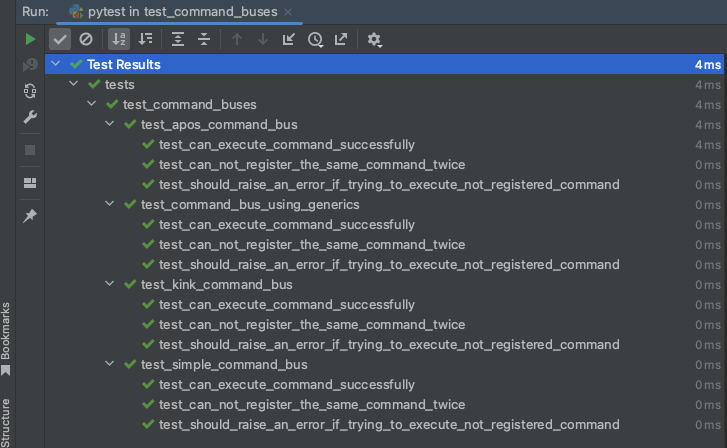

+++
author = "Szymon Miks"
title = "How to implement CommandBus in Python"
description = "An example implementation of CommandBus in Python"
date = "2023-08-10"
image = "img/mike-benna-X-NAMq6uP3Q-unsplash.jpg"
categories = [
     "Python", "Software_Development", "Architecture"
]
tags = [
    "python",
    "software development",
    "command bus",
    "architecture",
    "application design"
]
draft = false
+++

## Intro

In my [previous blogpost](/p/services-vs-command-handlers/), I compared services and command handlers.
In today's blogpost, I want to show you how to use commands and command handlers in connection with **CommandBus**.

**CommandBus** is the last missing bit in this whole puzzle.

We will start with the most straightforward implementation, then I will show you how to use libraries available in the Python ecosystem.
Finally, I want to show you an end-to-end example starting from the HTTP endpoint and ending at the command handled
in the command handler with the usage of the command bus.

Before we jump straight to the code, I will explain what **Command**, **CommandHandler**, and **CommandBus** are.

## What is a Command?

**Command** is a design pattern that encapsulates a request as an immutable object.

Can be executed immediately or at a later time or by different components within a system.

The Command pattern decouples the sender of a request from the receiver that performs the action.
It provides a way to encapsulate the details of an operation, such as the method to be called, the parameters required for the method, and the object that will execute the method.
This encapsulation allows the sender to be decoupled from the specifics of how the request is handled, making the system more flexible and extensible.

The most important! A command in software engineering is an object that represents an **intention**, **instruction** or **action** to be performed.
It typically includes all the necessary information for executing the **intention**.
By encapsulating requests as objects, commands can be easily manipulated, queued, or undone, providing a more flexible and modular design.

The relationship with CommandHandler is one-to-one, one command can have only one handler.

It is commonly employed in GUI applications, multi-level undo mechanisms, transactional systems, and event-driven architectures where decoupling components is essential.

You can read more about the Command as a design pattern in [this book](https://www.amazon.com/Design-Patterns-Elements-Reusable-Object-Oriented/dp/0201633612/)

## What is a CommandHandler?

**CommandHandler** is a component or class responsible for executing a command.

The CommandHandler acts as an intermediate layer between the client that creates and sends the command objects and the receiver that performs the actual action.
It receives the command object, extracts the necessary information, and then delegates the execution to the appropriate components of our system.


## What is a CommandBus?

**CommandBus** is a communication mechanism used to decouple the sender of a command from its handler or executor.
It is a part of the Command Pattern and is commonly used in applications that follow the CQRS (Command Query Responsibility Segregation) pattern or other similar architectural styles.

If you want me to write a separate article about CQRS with Python examples, please let me know :wink:.

The CommandBus acts as an intermediary that receives commands from clients and routes them to their corresponding **CommandHandlers**.
Instead of the client knowing which specific **CommandHandler** should be used to execute a particular command, it simply sends the command to the **CommandBus**, and the bus takes care of finding the appropriate handler and executing the command.


## Implementation

Firstly let me define an interface for our **CommandBus**.
It will allow us to hide the implementation details, we will change only the implementation depending on our needs.

The code and test tests can be found on my GitHub [here](https://github.com/szymon6927/szymonmiks.pl/tree/master/blog/examples/src/command_bus_examples)

```python
# blog/examples/src/command_bus_examples/command.py

class Command:
    pass
```

---

```python
# blog/examples/src/command_bus_examples/generic_handler.py

from typing import Generic, TypeVar

from src.command_bus_examples.command import Command

TCommand = TypeVar("TCommand", bound=Command)


class Handler(Generic[TCommand]):
    def __call__(self, command: TCommand) -> None:
        raise NotImplementedError

```

---

```python
# blog/examples/src/command_bus_examples/custom_types.py

from typing import Any, Callable, Union

from src.command_bus_examples.command import Command
from src.command_bus_examples.generic_handler import Handler

HandlerType = Union[Callable[[Any], None], Handler[Command]]

```

---

```python
# blog/examples/src/command_bus_examples/command_bus.py

from abc import ABC, abstractmethod
from typing import Type

from src.command_bus_examples.command import Command
from src.command_bus_examples.custom_types import HandlerType


class CommandBus(ABC):
    @abstractmethod
    def register_handler(self, command: Type[Command], handler: HandlerType) -> None:
        pass

    @abstractmethod
    def execute(self, command: Command) -> None:
        pass

```

---

```python
# blog/examples/src/command_bus_examples/errors.py

from __future__ import annotations

from src.command_bus_examples.command import Command


class CommandAlreadyRegistered(Exception):
    @classmethod
    def for_command(cls, command_type: str) -> CommandAlreadyRegistered:
        return cls(f"`{command_type}` has been already registered!")


class HandlerNotFound(Exception):
    @classmethod
    def for_command(cls, command: Command) -> HandlerNotFound:
        return cls(f"No handler has been found for {command}!")

```

### The simplest implementation

The simplest approach is to use a dictionary that will keep commands and corresponding command handlers.

```python
# blog/examples/src/command_bus_examples/simple_command_bus.py

from typing import Dict, Type

from src.command_bus_examples.command import Command
from src.command_bus_examples.command_bus import CommandBus
from src.command_bus_examples.custom_types import HandlerType
from src.command_bus_examples.errors import CommandAlreadyRegistered, HandlerNotFound


class SimpleCommandBus(CommandBus):
    def __init__(self) -> None:
        self._handlers: Dict[Type[Command], HandlerType] = {}

    def register_handler(self, command: Type[Command], handler: HandlerType) -> None:
        if command in self._handlers:
            raise CommandAlreadyRegistered.for_command(command.__name__)

        self._handlers[command] = handler

    def execute(self, command: Command) -> None:
        try:
            handler = self._handlers[type(command)]
            handler(command)
        except KeyError:
            raise HandlerNotFound.for_command(command)

```

### Implementation with the usage of existing libraries

There are a lot of libraries that give you the functionality of a **CommandBus**.
One of them is [apos](https://github.com/mkossatz/apos). I used this one in my examples.

```python
# blog/examples/src/command_bus_examples/apos_command_bus.py

from typing import Type

from apos import Apos, MissingHandler, OverwritingHandler

from src.command_bus_examples.command import Command
from src.command_bus_examples.command_bus import CommandBus
from src.command_bus_examples.custom_types import HandlerType
from src.command_bus_examples.errors import CommandAlreadyRegistered, HandlerNotFound


class AposCommandBus(CommandBus):
    def __init__(self) -> None:
        self._apos = Apos()

    def register_handler(self, command: Type, handler: HandlerType) -> None:
        try:
            self._apos.subscribe_command(command, handler)
        except OverwritingHandler as error:
            raise CommandAlreadyRegistered.for_command(command.__name__) from error

    def execute(self, command: Command) -> None:
        try:
            self._apos.publish_command(command)
        except MissingHandler as error:
            raise HandlerNotFound.for_command(command) from error

```

### Implementation with the usage of DI container

Another interesting approach may be an implementation with the usage of a DI container.
In my examples, I used the [kink](https://github.com/kodemore/kink) library.
It is a dependency injection container made for Python.

If you want to learn more about dependency injection I encourage you to read my blog post about it.
You can find it [here](/p/dependency-injection-with-python-make-it-easy/).

```python
# blog/examples/src/command_bus_examples/kink_command_bus.py

from typing import Type

from kink import Container
from kink.errors import ServiceError

from src.command_bus_examples.command import Command
from src.command_bus_examples.command_bus import CommandBus
from src.command_bus_examples.custom_types import HandlerType
from src.command_bus_examples.errors import CommandAlreadyRegistered, HandlerNotFound
from src.command_bus_examples.generic_handler import Handler


class KinkCommandBus(CommandBus):
    def __init__(self, container: Container) -> None:
        self._container = container

    def register_handler(self, command: Type[Command], handler: HandlerType) -> None:
        if not issubclass(handler.__class__, Handler):
            raise ValueError("Handler must be a subclass of Handler[TCommand]")

        if command in self._container:
            raise CommandAlreadyRegistered.for_command(command.__name__)

        self._container[command] = handler

    def execute(self, command: Command) -> None:
        try:
            handler = self._container[type(command)]
            handler(command)
        except ServiceError as error:
            raise HandlerNotFound.for_command(command) from error

```

As you can see I'm using the DI container as a registry for my commands and their handlers.

### Implementation with the usage of generics

Finally, we reached the last one :wink:

```python
# blog/examples/src/command_bus_examples/command_bus_using_generics.py

from typing import Dict, Type

from src.command_bus_examples.command import Command
from src.command_bus_examples.command_bus import CommandBus
from src.command_bus_examples.custom_types import HandlerType
from src.command_bus_examples.errors import CommandAlreadyRegistered, HandlerNotFound
from src.command_bus_examples.generic_handler import Handler


class CommandBusUsingGenerics(CommandBus):
    def __init__(self) -> None:
        self._handlers: Dict[Type[Command], HandlerType] = {}

    def register_handler(self, command: Type[Command], handler: HandlerType) -> None:
        if not issubclass(handler.__class__, Handler):
            raise ValueError("Handler must be a subclass of Handler[TCommand]")

        if command in self._handlers:
            raise CommandAlreadyRegistered.for_command(command.__name__)

        self._handlers[command] = handler

    def execute(self, command: Command) -> None:
        try:
            handler = self._handlers[type(command)]
            handler(command)
        except KeyError:
            raise HandlerNotFound.for_command(command)

```

Tests pass for each implementation :tada: let us move to the final example.



## Simple FastAPI application with the usage of CommandBus

In this section, I want to show you how to connect everything that I mentioned in this blog post.
I created a simple [FastAPI](https://fastapi.tiangolo.com/) application that has only two endpoints.
One for registering the user, and the second one for getting the user information.

The goal is to show you how all of these components work together.

```python
# blog/examples/src/command_bus_examples/fast_api_example/bootstrap.py

from src.command_bus_examples.command_bus import CommandBus
from src.command_bus_examples.command_bus_using_generics import CommandBusUsingGenerics
from src.command_bus_examples.fast_api_example.command_handlers import RegisterUserHandler
from src.command_bus_examples.fast_api_example.commands import RegisterUser
from src.command_bus_examples.fast_api_example.repository import InMemoryUserRepository, UserRepository

command_bus = CommandBusUsingGenerics()
user_repository = InMemoryUserRepository()
command_bus.register_handler(RegisterUser, RegisterUserHandler(user_repository))


def get_command_bus() -> CommandBus:
    return command_bus


def get_user_repository() -> UserRepository:
    return user_repository

```

---

```python
# blog/examples/src/command_bus_examples/fast_api_example/app.py

from typing import Annotated

import uvicorn
from fastapi import Depends, FastAPI, Request
from fastapi.responses import JSONResponse
from pydantic import BaseModel

from src.command_bus_examples.command_bus import CommandBus
from src.command_bus_examples.fast_api_example.bootstrap import get_command_bus, get_user_repository
from src.command_bus_examples.fast_api_example.commands import RegisterUser
from src.entity_id import EntityId
from src.command_bus_examples.fast_api_example.errors import UserAlreadyExist, UserNotFound, ValidationError
from src.command_bus_examples.fast_api_example.repository import UserRepository

app = FastAPI()


class RegisterUserRequest(BaseModel):
    first_name: str
    last_name: str
    email: str


@app.post("/users", status_code=201)
async def register_user(
    request: RegisterUserRequest, command_bus: Annotated[CommandBus, Depends(get_command_bus)]
) -> JSONResponse:
    user_id = EntityId.new_one()
    command_bus.execute(RegisterUser(user_id, request.first_name, request.last_name, request.email))

    return JSONResponse(content={}, headers={"Location": f"/users/{user_id}"})


@app.get("/users/{user_id}")
async def get_user(
    user_id: str, user_repository: Annotated[UserRepository, Depends(get_user_repository)]
) -> JSONResponse:
    user = user_repository.get(EntityId.of(user_id))
    return JSONResponse(content={"id": str(user.id), "full_name": user.full_name, "email": user.email})


@app.exception_handler(UserNotFound)
async def user_not_found_exception_handler(request: Request, exc: UserNotFound) -> JSONResponse:
    return JSONResponse(
        status_code=404,
        content={"message": f"Oops! {exc}"},
    )


@app.exception_handler(UserAlreadyExist)
async def user_already_exist_exception_handler(request: Request, exc: UserAlreadyExist) -> JSONResponse:
    return JSONResponse(
        status_code=409,
        content={"message": f"Oops! {exc}"},
    )


@app.exception_handler(ValidationError)
async def validation_error_exception_handler(request: Request, exc: ValidationError) -> JSONResponse:
    return JSONResponse(
        status_code=400,
        content={"message": f"Oops! {exc}"},
    )


if __name__ == "__main__":
    uvicorn.run("app:app", host="127.0.0.1", port=8000, reload=True)

```

our command handler:

```python
# blog/examples/src/command_bus_examples/fast_api_example/command_handlers.py

from email_validator import EmailNotValidError, validate_email

from src.command_bus_examples.fast_api_example.commands import RegisterUser
from src.command_bus_examples.fast_api_example.errors import ValidationError
from src.command_bus_examples.fast_api_example.repository import UserRepository
from src.command_bus_examples.fast_api_example.user import User
from src.command_bus_examples.generic_handler import Handler


class RegisterUserHandler(Handler[RegisterUser]):
    def __init__(self, user_repository: UserRepository) -> None:
        self._user_repository = user_repository

    def __call__(self, command: RegisterUser) -> None:
        try:
            validated_email = validate_email(command.email, check_deliverability=False)

            self._user_repository.save(User(command.id, command.first_name, command.last_name, validated_email.email))
        except EmailNotValidError as error:
            raise ValidationError(f"Provided email value `{command.email}` is not correct") from error

```


If you want to check all the source files,
the code is also available on my GitHub https://github.com/szymon6927/szymonmiks.pl/tree/master/blog/examples/src/command_bus_examples/fast_api_example


## Outro

You reached this section - thank you!

Just as a small recap:
- **command** - an intention to be performed, we may also say that it is "something that changes the state of our system"
- **command handler** - the component responsible for executing a command
- **command bus** - communication mechanism used to decouple the sender of a command from its handler

My goal in writing this blog post was to show you the general idea behind **CommandBus** as a pattern.

Don't be strict with the implementation I showed here.
The implementation details may differ, do not treat it as the one and only correct solution :wink:.

If you have any interesting approaches to the implementation of CommandBus - I would love to see them.

That's all, let me know what you think, and leave a comment if you have any questions :wink:

Happy coding!
